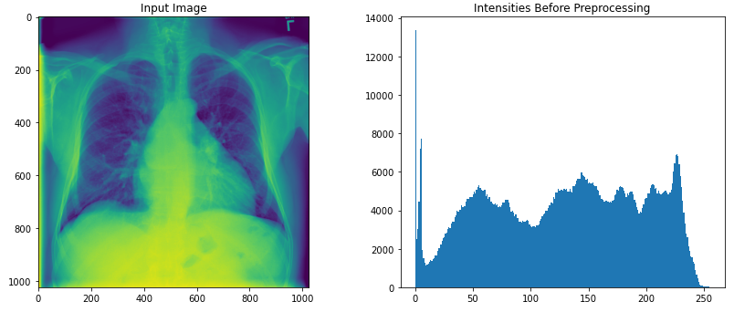

# Pneumonia Detection from Chest X-Rays

  

**Summary**

Apply a convolutional neural network to detect Pneumonia in X-Ray images.

Part 1) Exploratory Data Analysis of NIH X-Ray dataset.
*EDA.ipynb*

Part 2) Build and train model.
*Train_model.ipynb*

Part 3) Load and execute model for inference on test data.
*Inference.ipynb*

Project completed as part of Udacity AI for Healthcare course (2020).
